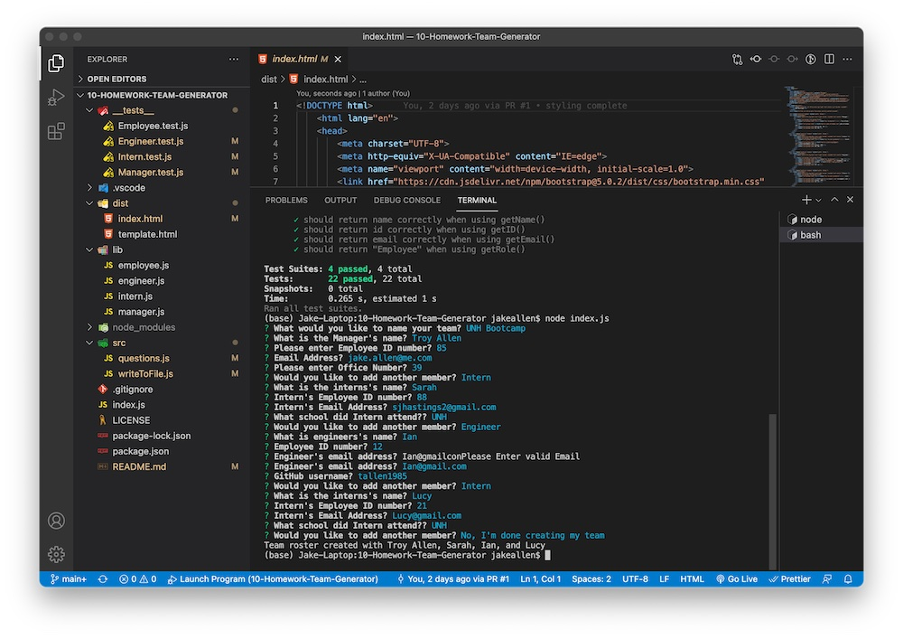

  
  
  # Team Profile Generator
  ## Description
  Node.js Project utilizing OOP and testing to dynamically create a software dev team
  
  ## Table of Contents
  - [Installation](#installation)
  - [Usage](#usage)
  - [Contributing](#contributing)
  - [License](#license)
  - [Questions](#questions)
  ## Installation
  npm i
  ## Usage
  node index.js
      
  ## Contributing
 Open Source
  ## License
  This project is protected under MIT License.

  ## Testing
  Npm test

[License Documentation](https://opensource.org/licenses/MIT)
  ## Questions
  [Ask me on my github profile](http://www.github.com/tallen1985)
  
  Any additional questions, reach me at my email jake.allen@me.com

  ## Screenshot
  

  ## Link to Video
  [Performance Video](https://drive.google.com/file/d/1O1Vj478-galJBPbh3s8HmGKeaXZajxgz/view)
  